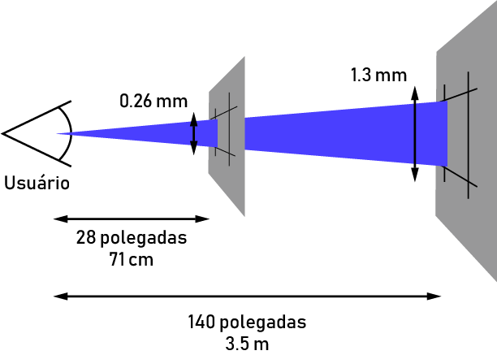
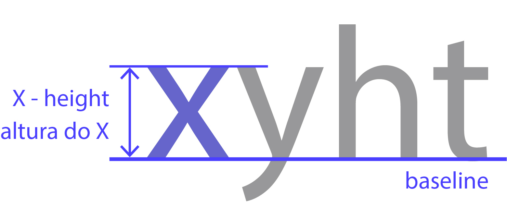
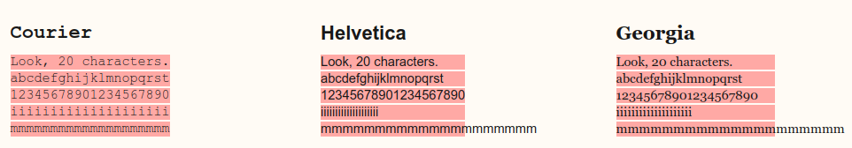

# Medidas Absolutas

## Pixel (px)
O píxel do CSS *não* é realmente um píxel da tela do dispositivo (hardware), e sim o que chamamos de píxel de referência que geralmente é maior do que o píxel real.  
A definição de píxel de referência no CSS é o ângulo visual(0.0213deg) de um píxel em um dispositivo com a densidade de 96dpi a uma distancia de um braço do leitor (28 polegadas), veja na imagem abaixo:  


## Points (pt)
Essa medida é geralmente utilizada em propriedades relacionadas a fonte do seu projeto.  
Geralmente espera-se que essa medida seja utilizada em folhas de estilo para *impressões*, quando se precisa ter certeza do tamanho da fonte utilizada. Não é recomendada para a estilização em tela!

## Inches/Polegadas (in)
Geralmente vemos elas quando queremos comprar uma nova TV ou monitor, mas essa unidade também existe no mundo Web.  
Apesar de existirem, elas não costumam ser utilizadas em projetos, uma vez que não existem usos práticos para elas (podemos atingir os mesmos resultados utilizando outras unidades).

## Centímetro e Milímetro (cm/mm)
Apesar de bastante comuns, tanto centímetro e milímetro são pouco usadas no CSS.  
Assim como o **pt**, o uso dessas duas é esperado para folhas de estilo para *impressões* (medidas mais precisas), evitando que elas sejam aplicadas para exibições em tela.

## Paica (pc)
Também uma unidade pouco usada no mundo web, a Paica também vem para o CSS sendo herdada da tipografia.  
A relação entre as unidades absolutas é:  
1**in** = 2.54**cm** = 25.4**mm** = 72**pt** = 6**pc**

# Medidas Relativas

## Em (em)
Nossa primeira unidade relativa é bastante famosa no mundo CSS.  
Dificilmente você achará algum navegador que não tenha suporte para essa medida, que está presente desde os primórdios.  
Mas como funciona esse tal de **em**?  
Essa unidade muda para os elementos filhos de acordo com o tamanho da fonte (font-size) do elemento pai.  
Digamos que temos o seguinte html:  
```
<style>
    #div{
        font-size: 16px;
    }

    #filho{
        font-size: 2em;
    }
</style>

<div id="pai">
    div pai
    <div id="filho">
        div filho
    </div>
</div>
```
Nesse nosso caso, para a div mais interna (id=filho), 1**em será igual a 16px**, seguindo a lógica, **2em será igual a 32px** e assim por diante.  
Podemos colocar valores como 1.5 também! Nesse nosso caso, **1.5em será igual a 24px.**  
O último ponto que devemos nos atentar ao usar o em é que quando usamos essa medida, nós temos que considerar o font-size de todos os elementos pai. Por exemplo, se tivéssemos uma terceira div mais interna no nosso exemplo anterior e definirmos o tamanho da fonte para **2em**, nesse caso esses **2em seriam 64px**, uma vez que o font-size do elemento pai foi definido sendo **32px(2em)**!

## Rem (rem, "root em")
O REM vem como sucessor do EM e ambos compartilham a mesma lógica de funcionamento (font-size), porém a forma de implementação é diferente.  
Enquanto o **em** está diretamente relacionado ao tamanho da fonte do elemento pai, o **rem** está relacionado com o tamanho da fonte do elemento root (raiz), no caso, a **tag HTML.**  
Dito isso, se definirmos que o font-size desse elemento será de 18px, então **1rem = 18px, 2rem = 36px** e assim por diante... Normalmente os browsers especificam o tamanho default da fonte do elemento root (raiz) sendo 16px.

## Percent (%)
A porcentagem permite que criemos módulos que sempre vão se readaptar para ocupar a quantidade especificada. Por exemplo, se definirmos um elemento tendo um tamanho de **50%**, independente do dispositivo em questão, esse módulo sempre ocupará metade do espaço que lhe cabe (caso esteja dentro de algum outro elemento).  
Repare que se alterarmos o tamanho da div container, o elemento interior a ela se redimensionará de forma a sempre ocupar a porcentagem especificada no CSS!  
Portanto, ao trabalharmos com a porcentagem, temos o mesmo problema que tinhamos com o em, quanto mais elementos aninhados, mais complicado será de definirmos exatamente o tamanho, por isso, tenha cuidado quando utilizá-la!

## Ex
Talvez você nunca tenha ouvido falar dessa unidade do CSS, mas ela existe.  
Diferentemente da forma como a EM e a REM funcionavam, essa unidade não se relaciona com o tamanho da fonte (font-size), mas com qual fonte está sendo utilizada naquele momento (font-family), mais especificamente ao tamanho do caractere x dessa fonte em questão (x-height).  
Como o browser sabe esse valor? Esse valor pode vir diretamente com a fonte, o browser pode medir o caractere em caixa baixa (lower case) e se esses dois não funcionarem, o browser estipula um valor de 0.5em para 1ex.

O uso dessa unidade está mais presente em ajustes tipográficos, nos dando um controle mais preciso quando o padrão definido para algumas tags não se adéqua corretamente ao nosso layout.

## Ch
Também uma unidade pouco conhecida, o ch (character unit) é definida na documentação como sendo a "medida avançada" da largura do caractere zero ("0").  
A ideia é que um elemento com, por exemplo **100ch** de largura poderá comportar uma string de 100 caracteres dessa determinada fonte, caso essa fonte seja monospace (todos os caracteres têm o mesmo tamanho).  
Fontes com a largura variável, qualquer caractere pode ser mais largo ou menos largo que o zero ("0"), como podemos ver na imagem abaixo:

Como podemos analisar, a tipografia Courier (monospace) obedece a regra acima, porém as outras duas não! O que podemos tirar após observações é que normalmente **1ch** é 20% - 30% mais largo, porém isso não é uma verdade absoluta e deve ser observado para cada fonte que você deseja aplicar.

## Vw (viewport width)
Essa medida faz parte das medidas mais atuais e do futuro do CSS. Como escrito no título, vw significa viewport width, mas o que é viewport?  
Viewport nada mais é que a área visível de uma página web para o seu usuário, essa viewport pode variar de acordo com o dispositivo, sendo menor em celulares e maior em desktops.  
Essa unidade se relaciona diretamente com a largura da viewport, onde **1vw representa 1%** do tamanho da largura dessa área visível. A diferença entre **vw** e a **%** é bem semelhante a diferença entre **em** e **rem**, onde a **%** é relativa ao contexto local do elemento e o **vw** é relativo ao tamanho total da largura da viewport do usuário.

### Vh (viewport height)
Essa unidade funciona da mesma forma que o vw, porém dessa vez, a referência será a altura e não a largura.

### Vmin (viewport minimun)
Essa unidade também se relaciona com as dimensões da viewport, mas com um porém. Anteriormente quando vimos **vh** e **vw** precisávamos escolher se gostaríamos de nos basear na altura (vh) ou na largura (vw) da viewport.  
Diferentemente das anteriores, o **vmin** utilizará como base a menor dimensão da viewport (altura x largura), vamos ao exemplo.  
Imagine que estamos trabalhando com uma viewport de 1600px de altura e 900px de largura. Nesse caso, **1vmin** terá o valor de **9px** (1% da menor dimensão!), caso tenhamos **100vmin**, esse será igual a **900px**! Interessante né?  
No caso acima, a menor dimensão foi a da largura, porém se tivéssemos 300px para altura e 1400px para largura, nosso valor de referência seria o 300px! Sempre a **menor** dimensão!

### Vmax (viewport maximum)
Seguindo a mesma base lógica da unidade anterior, o **vmax** terá como valor de referência a maior dimensão da viewport. Ou seja, utilizando o mesmo exemplo, se tivermos 1600px de altura e 900px de largura, **1vmax** será equivalente a **16px**!  
No segundo exemplo ocorrerá a mesma inversão, tendo 300px para altura e 1400px para largura, **1vmax** será equivalente a **14px**. Dessa vez sempre será a **maior** dimensão!

# Conclusão
Como podemos perceber, existem várias unidades que podemos utilizar no mundo web, mas sempre surgem aquelas perguntas de quando tenho que utilizar? Qual a melhor? etc...  
Não existe resposta certa nem errada para essas perguntas, infelizmente não temos uma regra de ouro para todas as situações. O uso dessas unidades depende de diversos fatores como equipe, preferência, familiaridade e assim por diante.  
Entretanto, é importante que você como **web developer** tenha todas essas ferramentas no seu cinto de utilidades já que nunca sabemos quando precisaremos utilizar.  
Definitivamente a inclusão das unidades da **viewport** foram positivas para a web quando estamos lidando com layout flexível, cabe a você começar a colocá-las em uso durante seu dia a dia!
